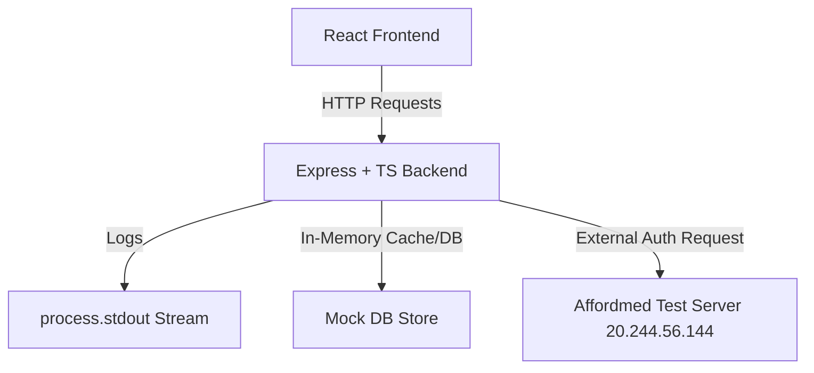

# Affordmed Campus Notification Platform - System Design Document

This document outlines the architecture, API contracts, database structure, and design decisions for the Affordmed Full Stack Campus Notification Platform.

---

## 1. System Architecture



### Architectural Decisions:
1. **Express & TypeScript Backend**: Chosen for fast development, type safety, and robust middleware support. TypeScript enforces strict types for notification payloads and request parameters.
2. **In-Memory Data Store**: As this is an evaluation and no persistent database was requested, we implement a memory-safe, asynchronous-ready in-memory mock store for notifications to manage state (read/unread statuses).
3. **Graceful Fallback Authentication (Mock Mode)**: If the Affordmed test server is unreachable, the system automatically checks `USE_MOCK_AUTH=true` and verifies requests using a secure, local mock Bearer Token.

---

## 2. REST API Endpoints & Contracts

### 2.1 Registration (Stage 2)
Registers the candidate application.
* **Endpoint:** `POST http://20.244.56.144/test/register`
* **Request Body:**
  ```json
  {
    "companyName": "Affordmed",
    "ownerName": "Nipun Kulshrestha",
    "rollNo": "2303051050480",
    "ownerEmail": "nipunkulshrestha25@gmail.com",
    "accessCode": "cJqaEB"
  }
  ```
* **Response (200 OK):**
  ```json
  {
    "companyName": "Affordmed",
    "clientID": "0ae3da82-8427-4f1b-9e03-4ba06ba653cc",
    "clientSecret": "dkvATBGvtUZcgFRc",
    "ownerName": "Nipun Kulshrestha",
    "ownerEmail": "nipunkulshrestha25@gmail.com",
    "rollNo": "2303051050480"
  }
  ```

### 2.2 Authentication (Stage 3)
Obtains the temporary authorization token.
* **Endpoint:** `POST http://20.244.56.144/test/auth`
* **Request Body:**
  ```json
  {
    "companyName": "Affordmed",
    "clientID": "0ae3da82-8427-4f1b-9e03-4ba06ba653cc",
    "clientSecret": "dkvATBGvtUZcgFRc",
    "ownerName": "Nipun Kulshrestha",
    "ownerEmail": "nipunkulshrestha25@gmail.com",
    "rollNo": "2303051050480"
  }
  ```
* **Response (200 OK):**
  ```json
  {
    "token_type": "Bearer",
    "access_token": "mock-bearer-token-roll-2303051050480-secret-dkvATBGvtUZcgFRc",
    "expires_in": 1713876000
  }
  ```

### 2.3 Fetch Notifications (Stage 1)
Retrieves a paginated list of notifications for the logged-in user.
* **Endpoint:** `GET /api/v1/notifications`
* **Headers:** `Authorization: Bearer <token>`
* **Query Parameters:**
  * `page` (integer, default: 1)
  * `limit` (integer, default: 20)
  * `notification_type` (string, optional: "Event", "Result", "Placement")
* **Response (200 OK):**
  ```json
  {
    "meta": {
      "current_page": 1,
      "total_pages": 5,
      "total_count": 100
    },
    "notifications": [
      {
        "id": "d146095a-0d86-4a34-9e69-3900a14576bc",
        "type": "Result",
        "message": "mid-sem",
        "timestamp": "2026-04-22 17:51:30",
        "is_read": false
      }
    ]
  }
  ```

### 2.4 Fetch Unread Count
Returns the count of unread notifications.
* **Endpoint:** `GET /api/v1/notifications/unread-count`
* **Headers:** `Authorization: Bearer <token>`
* **Response (200 OK):**
  ```json
  {
    "unread_count": 5
  }
  ```

### 2.5 Mark Notification as Read (Single)
Updates the status of a specific notification.
* **Endpoint:** `PATCH /api/v1/notifications/:id/read`
* **Headers:** `Authorization: Bearer <token>`
* **Response (200 OK):**
  ```json
  {
    "success": true,
    "message": "Notification marked as read"
  }
  ```

### 2.6 Mark All as Read (Bulk)
Updates all unread notifications to read.
* **Endpoint:** `POST /api/v1/notifications/mark-all-read`
* **Headers:** `Authorization: Bearer <token>`
* **Response (200 OK):**
  ```json
  {
    "success": true,
    "message": "All notifications marked as read"
  }
  ```

---

## 3. Observability and Logging Middleware (Stage 4)
We implemented a custom, reusable middleware that intercepts incoming HTTP requests.

### Design Choice: Asynchronous Streams
Instead of using synchronous `console.log()` (which blocks the Node.js single-threaded event loop), the logging middleware writes directly to `process.stdout` asynchronously.
Logs follow this structured format:
`[<timestamp>] [IP: <client_ip>] <method> <path> - Status: <status_code> - Duration: <response_time>ms`

---

## 4. Priority Notifications (Stage 6 Preview)
The platform must support sorting notifications by priority.
* **Priority Calculation**: Notifications are prioritized based on:
  1. Status: **Unread** notifications always have higher priority than **Read** ones.
  2. Type: **Placement** > **Result** > **Event**.
  3. Recency: **Newer** timestamps > **Older** timestamps.
* **Sorting Mechanism**: We will implement a custom comparator function utilizing JavaScript's `.sort()` method or a Priority Queue structure to serve highly critical notifications first.